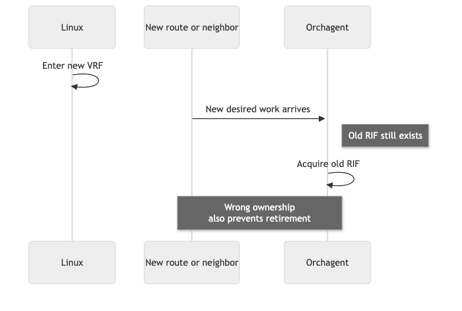
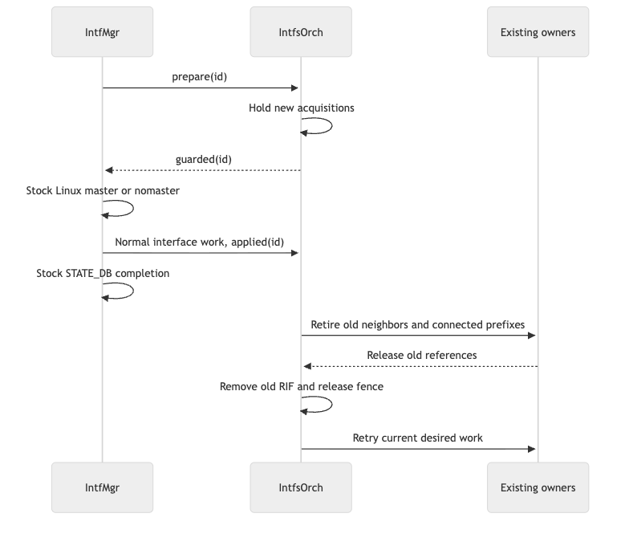
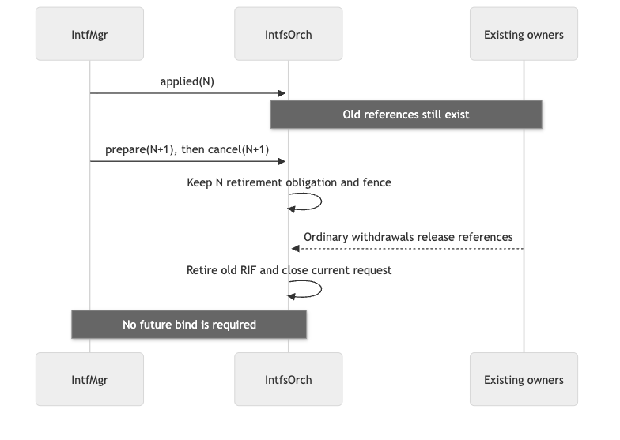

# Guard interface binding against wrong-RIF acquisition

## Overview

A Linux interface can enter its new VRF while orchagent still owns its old router interface (RIF). A new route or neighbor can then acquire the old RIF. The resulting reference also prevents retirement of that RIF.

Fence new acquisitions before changing the Linux binding. Retire the old hardware through its existing owners, then admit the current desired interface and its dependent work. Keep the stock CLI, CONFIG_DB API, and asynchronous interface-removal completion.

This design does not infer a route's outgoing VRF from its route table. That inference would reject legitimate route leaking. It does not require FRR metadata changes.

## Requirements

- An acknowledged fence precedes the relevant Linux `master` or `nomaster` operation. Acknowledgment means admission is held, not that hardware has retired.
- A removal needs no later bind request or future target. Linux and STATE_DB removal complete independently of ASIC cleanup.
- Old-owner withdrawals continue while new acquisitions wait. Refusal reaches the caller that owns the retry; it must not become a missing-next-hop lookup or a fabricated successful bulk operation.
- Retained retirement work survives interface DEL→SET coalescing. Desired neighbor work survives removal of its old hardware cache.
- A stale request or acknowledgment cannot authorize another binding. A replacement request transfers the fence without briefly opening admission.
- Unrelated interfaces and steady-state route leaking keep upstream behavior. Do not introduce a permanent wait into a case that converges upstream.

## Design

### Trigger and ownership

Existing remove/unbind and bind operations remain separate. A removal needs no future target. Before named-to-default `nomaster`, removal waits for acknowledgment that admission is held—not for old references or ASIC retirement. If acknowledgment is unavailable, the operation remains pending. Ordinary STATE_DB removal does not certify ASIC retirement.

IntfMgr also prepares the fence before attaching a new routed root (the interface-level entry) to a named VRF. Removing an already-default root does not invent a target or wait for another command. Loopback lifetime is separate from a port RIF.

IntfMgr remains the sole Linux binding owner. IntfsOrch owns the fence, current RIF inventory, and old-interface retirement. RouteOrch, NeighOrch, and next-hop-group owners retain their normal reference and retry responsibilities. Hardware inventory lookups remain available to withdrawal paths; they are not admission permission.



*Figure 1. The wrong-RIF race.*

<details>
<summary>Sequence source</summary>

```text
sequenceDiagram
    participant L as Linux
    participant N as New route or neighbor
    participant O as Orchagent
    L->>L: Enter new VRF
    N->>O: New desired work arrives
    Note right of O: Old RIF still exists
    O->>O: Acquire old RIF
    Note over N,O: Wrong ownership<br/>also prevents retirement
```

</details>

The fence changes this ordering:



*Figure 2. Admission acknowledgment precedes the binding change; retirement is asynchronous.*

<details>
<summary>Sequence source</summary>

```text
sequenceDiagram
    participant M as IntfMgr
    participant O as IntfsOrch
    participant D as Existing owners
    M->>O: prepare(id)
    O->>O: Hold new acquisitions
    O-->>M: guarded(id)
    M->>M: Stock Linux master or nomaster
    M->>O: Normal interface work, applied(id)
    M->>M: Stock STATE_DB completion
    O->>D: Retire old neighbors and connected prefixes
    D-->>O: Release old references
    O->>O: Remove old RIF and release fence
    O->>D: Retry current desired work
```

</details>

There is no prolonged extra link-down interval. Use the stock binding operation and its native Linux link notifications. Checked link-local cleanup remains a separate, root-removal-only prerequisite and retains state on failure. Verified device absence discharges kernel-only cleanup; it does not certify hardware retirement.

### Request correlation

Use two internal tables. There are no new CONFIG_DB fields or CLI options.

- APP_DB `INTF_GUARD_TABLE:<alias>` carries `id` and `action` notifications.
- STATE_DB `INTERFACE_GUARD_TABLE|<alias>` carries manager-owned `request_id`, `action`, `target_vrf`, `kernel_pending`, and `applied_id`. IntfsOrch writes `id` and `state` acknowledgments and `retired_id` after old-owner cleanup.

IntfMgr allocates a monotonically increasing request ID from the retained per-alias record. It persists the request before notifying IntfsOrch. IntfsOrch validates the notification against that current request; queued or superseded data alone has no authority. Retain the terminal record rather than an ever-growing set of old request IDs.

`prepare` closes admission. IntfMgr may change Linux only after a matching `guarded` or `retired` acknowledgment. `applied` records a completed Linux binding operation and carries its retirement obligation independently of the interface queue. `cancel` is valid only if that request has not changed Linux; it does not certify retirement. Retries reissue the same request. Startup reconstructs active fences from retained request state before admitting dependent work.

`target_vrf` is the target of the operation already being executed, including empty/default for `nomaster`. It is not a future command's destination, route-origin metadata, or a new removal prerequisite.

Set `kernel_pending` before the guarded Linux operation and clear it after ordinary STATE_DB completion. A replaced or canceled partially applied request therefore still performs guarded `nomaster`. Keep the latest applied ID separate from the latest retired ID: canceling a newer prepare cannot discard an earlier applied move.

For process restart with retained request state, reconstruct active and completed guards before admitting work. Cancel an orphan prepare only when no existing root or unfinished kernel operation requires removal. Resume a retained removal even before its first kernel attempt, recovering link-local cleanup from the old APP root. Queue that removal before a different-VRF successor; it must not depend on the successor VRF being ready. Same-VRF cancellation and retry retain their existing behavior. This does not promise recovery from arbitrary loss of database or hardware state.



*Figure 3. Canceling a newer request does not discard earlier retirement work.*

<details>
<summary>Sequence source</summary>

```text
sequenceDiagram
    participant M as IntfMgr
    participant O as IntfsOrch
    participant D as Existing owners
    M->>O: applied(N)
    Note over O,D: Old references still exist
    M->>O: prepare(N+1), then cancel(N+1)
    O->>O: Keep N retirement obligation and fence
    D-->>O: Ordinary withdrawals release references
    O->>O: Retire old RIF and close current request
    Note over M,O: No future bind is required
```

</details>

### Retirement and replay

An applied request owns old-interface retirement even if Redis coalesces the corresponding root DEL and SET. Remove old connected prefixes through IntfsOrch and neighbors through NeighOrch. Do not manufacture FRR withdrawals or discard counted route/NH references. Retry failed or referenced removals. Retire the RIF only after its actual owners release it.

NeighOrch keeps desired neighbor input separate from its hardware cache. If a desired SET was already consumed, successful old-neighbor removal requeues it. A newer pending SET or DEL takes precedence. This covers both consumed and still-pending updates; preserving only the latter is insufficient.

The active guard applies to the routed admission paths, including cached neighbor and next-hop-group reuse. It does not broaden upstream restrictions during an unguarded removal. Existing withdrawals retain their old IDs and make progress. Fine-grained ECMP withdrawal and fallback behavior is unchanged; an in-use RIF removal remains pending as upstream does.

On release, ordinary consumer retries recreate the current desired root, addresses, neighbors, and routes. An acknowledgment notification wakes pending manager work; retained state remains authoritative and timeout retries cover a lost wakeup. The dispatcher must also revisit pending work under continuous input.

## Compatibility and validation

Run paired tests for default→named, named→default, named→named, independent and canceled removal, VLAN/LAG/sub-port interfaces, both address families, addressless/link-local roots, direct/gateway/ECMP/FG-ECMP routes, leaks, churn, and supported reload/restart paths. Check Linux, FRR, APP/STATE/ASIC_DB, neighbor/NH/RIF identity and counts, and forwarding separately. Force consumer interleavings, command/SAI failure, stale control data, DEL→SET coalescing, and both neighbor replay schedules in native tests.

Verify no new stall, wrong RIF, lost desired neighbor, or changed removal-completion contract. Unrelated inherited limitations are not newly promised fixes.
